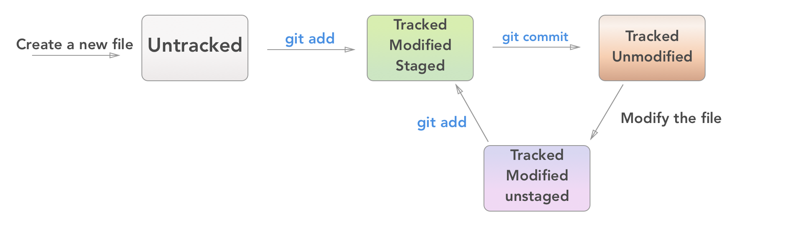
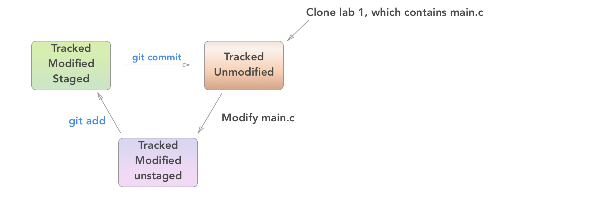

# Git #

For this part of the recitation, we will follow Jae's "git-tutorial" which can
be found on the mailing list and the course website. Here's a quick run through
of the operations reviewed in the tutorial, along with some bonus operations.

Git is version control software, where version control is "a system that records
changes to a file or set of files over time so that you can recall specific
versions later"
([source](http://git-scm.com/book/en/v2/Getting-Started-About-Version-Control)).
In other words, if you mess up your code really badly, you can use git to
gracefully step back to an earlier version. To facilitate this, git needs you to
take periodic snapshots of your code, called 'commits' in git parlance.

In this class, we require that you make git commits to get full credit for your
work. We want you to learn git because in industry, you will without a doubt be
using version control.

## Version Control ##

A Version Control System (VCS) records changes made to a set of files. This allows programmers to maintain backups of their previous work without manually copying their files

## Configuration ##

You need to set your name and email so that your commits are associated with
your identity:

    git config --global user.name "Your Full Name"
    git config --global user.email your_uni@columbia.edu

It's also nice to enable color in your console when using git:

    git config --global --add color.ui auto

And set your editor globally (here vim, if you prefer emacs use that). Note that
using the graphical version, `gvim`, is trickier, so we recommend you stick
to the command line version.

    echo "EDITOR=vim" >> ~/.bashrc

## Getting Started ##
In order to version control a directory, you have to 'initialize' it:

    git init

 **But in this class, we won't be using `git init`**. Instead, all students start by
 making an exact copy of Jae's skeleton code. Git supports 'cloning', which does just 
 that:

    git clone [source_directory] [destination_directory]

With the above command, you can take Jae's files and create your own copy. Neat!

## Updating Your Versioning ##
Not all the files in a version controlled directory have to be under version control.
You have to explicitly tell git to watch for changes in certain files. For information
on which files are version controled, which have changed, etc. run:

    git status

This will bring up file statuses. Remember that 'commiting' is equivalent to taking a
snapshot at that time.

There are 4 file statuses:

1. **Untracked**: git is not watching for changes in this file.
2. **Tracked, unmodified**:  git is watching this file for changes, but nothing has changed.
3. **Tracked, modified, unstaged**: git is watching this file and it has changed, but you haven't told git you want to include the file in your next commit.
4. **Tracked, modified, staged**: git is ready to commit the changes you've made.

To move a file from status 3 to 4 (i.e. to ensure that the next commit you make registers 
the changes you made to a file), you have to 'stage' it using the `add` command:
    
    git add file1 file2
    git add -p                      # individually pick for each set of changes whether to stage it
    
Once you have at least one file that is modified and staged, you can commit: 

    git commit -m "some message"    # explain what changes you made between now and your previous commit

### Other Very Useful Commands ###

Checking up on your changes:

    git status
    git diff
    git diff file1
    git diff --cached
    git log
    git log --stat --summary
    git log -p

To only stage changes (including deletions) to already tracked files, without adding untracked files:
    
    git add -u

To remove a file from your git files, run:

    git rm file1
    
To change a filename in git: 

    git mv oldfilename newfilename

Undoing changes:

    git checkout -- [filename]
    git reset HEAD [filename]

Going back in time:

    git checkout <commit hash>

## Examples ##

Case 1: Adding a new file

Case 2: Working on an existing file from git repository

## Other Tools ##

    git grep [pattern]
    git help
    git help commit
    man git
    man gittutorial

Patches are rarely necessary, but the submit script for this class uses them.

    git format-patch --stdout origin > mywork.mbox
    git am path/to/mywork.mbox

Remotes:

    git remote add
    git pull
    git fetch && git merge
    git push

### gitignore ###
Git wants to track everything, but you don't want it to track everything. In
particular you want to ignore all your object (`.o`) files, and your compiled
executables. You can tell git to ignore certain files by using a gitignore file.
It's a list of file names (including wildcards [when you use an asterisk]) 
for git to ignore when running commands like status.

In your repository create a file named `.gitignore`, where each line is a
pattern of filenames git should ignore. 

Example .gitignore file:

    a.out
    *.o
    *.a
    main
    *.mbox
    /labN-2015*

You can add the `.gitignore` file itself to the `.gitignore`, or you can add it
to the repository. You may also create a global ignore file so you don't have to
copy it to each repository. More details about that are in Github's help on
[ignoring files](https://help.github.com/articles/ignoring-files).

### Bonus ###

All of these recitation notes are tracked using git and hosted on GitHub. If we
have time we'll come back to this during recitation, but here's some GitHub 101.

1. Create an account by going to [github.com](http://github.com) and signing up.
Then, [configure git for use with remote
servers](https://docs.github.com/en/get-started/quickstart/set-up-git).

2. Add your SSH keys to github. They have [a handy
tutorital](https://docs.github.com/en/authentication/connecting-to-github-with-ssh/generating-a-new-ssh-key-and-adding-it-to-the-ssh-agent) to help out.
All you should need to do is Step 4 - adding ssh keys.

3. Try [forking](https://docs.github.com/en/get-started/quickstart/fork-a-repo) [this
repository](https://github.com/cs3157/recitations). Pull your fork to
your local machine.

    **Digression**: One of the reasons git is so great for working
in distributed teams is a feature called branching. Branches are subsections of git
commits that don't affect other branches. For example "master" is the branch
that you'll do all your work on for this class. Let's say though you want to
add more unix commands to recitation-1.md. You could create a branch called
`improve_recitation1_unix` like so:

        git checkout -b improve_recitation1_unix

    This would create a new branch, and switch to it. On this branch you would make
and commit your changes. When finished, you could switch back to the master
branch and merge your changes from the feature branch as follows:

        git checkout master
        git merge improve_recitation1_unix

    The reason branching is so useful is that it allows for multiple people to work
on their own issues, and then merge their changes in only *after* they are
certain their changes will not cause problems to the master branch. In this way,
the master branch always represents a completely functioning project, while the
branches may have broken code.

    Anyway, all this was a bit of a digression to discuss branching, but now that
you have a fork of my respository, you can make changes on the master branch.
When you're done, use `git push origin master` to push your changes back up to
your fork, and then go to github.com to pull-request your changes. If I like
what you've done, I'll definitely accept your pull request.

And that's about it for GitHub. Forking and branching are crucial to working on
teams, both private and open-source. GitHub and git are great tools for managing
all sorts of things, even notes, so make sure you're familiar with them.
Proficiency in git and github is a desirable trait to have when job-hunting.

Other useful tutorials:

- [Be Social](https://docs.github.com/en/get-started/quickstart/be-social)
- [Create a Repository](https://docs.github.com/en/get-started/quickstart/create-a-repo)
